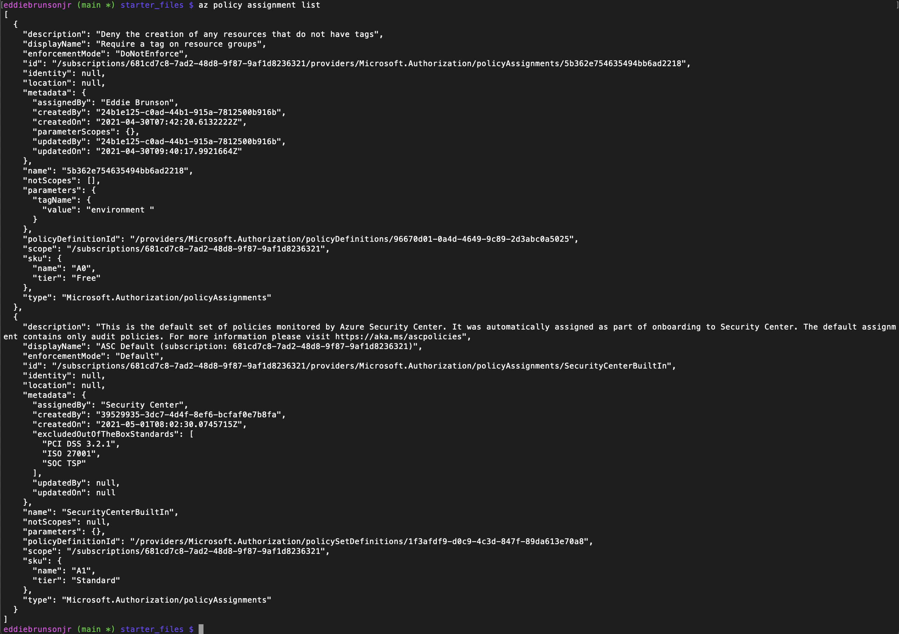
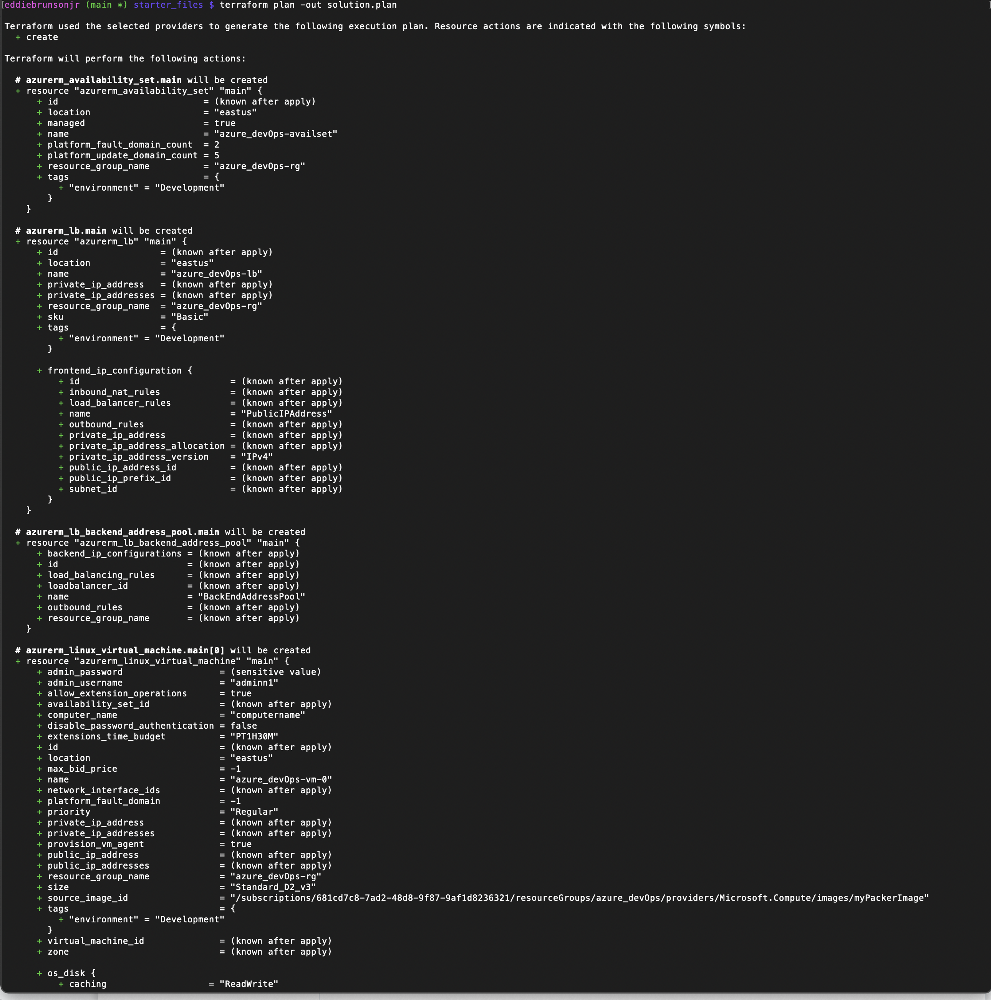
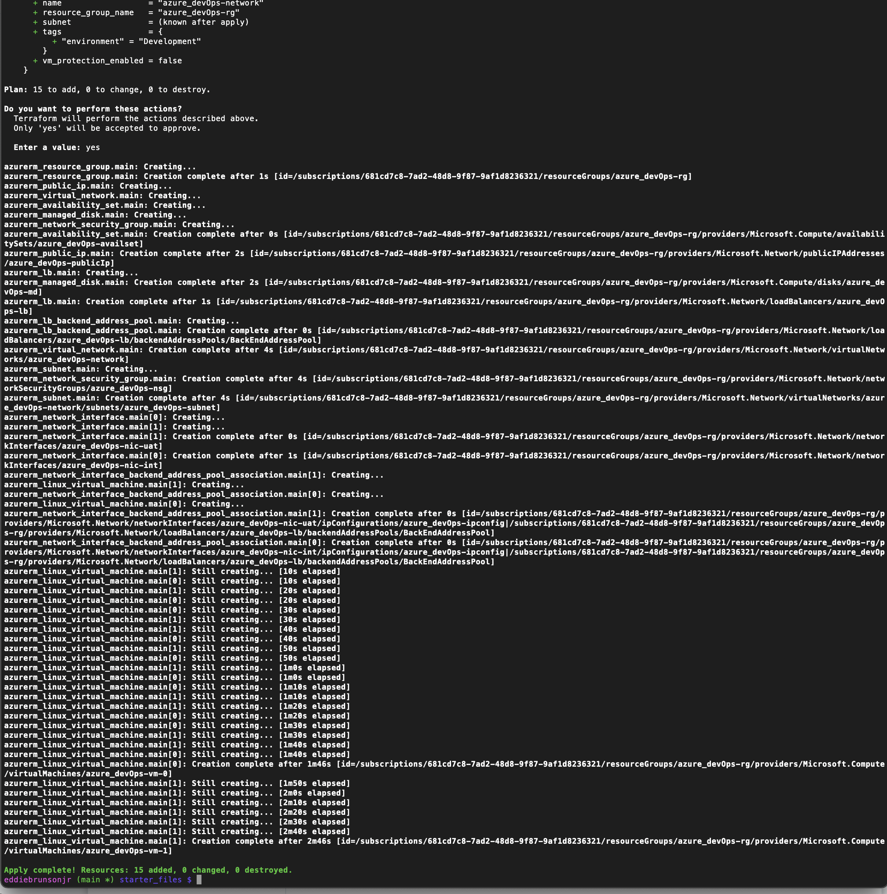

# Azure Infrastructure Operations Project: Deploying a scalable IaaS web server in Azure

### Introduction
For this project, I was required to write a Packer template and a Terraform template to deploy a customizable, scalable web server in Azure.

### Getting Started
1. Clone this repository
2. Create a tagging policy for Azure 
3. Create a Packer file to server your image
4. Create your infrastructure as code (IaC) using Terraform
5. Deploy your IaC using Terraform 

### Dependencies
1. Create an [Azure Account](https://portal.azure.com) 
2. Install the [Azure command line interface](https://docs.microsoft.com/en-us/cli/azure/install-azure-cli?view=azure-cli-latest)
3. Install [Packer](https://www.packer.io/downloads)
4. Install [Terraform](https://www.terraform.io/downloads.html)

### Instructions

#### Deploy a Policy 

1. Write a policy definition to deny the creation of resources that do not have tags. 
2. Export your environment variables for `client_id`, `client_secret`, and `subscription_id`. 
3. Apply the policy definition to the subscription with the name "tagging-policy" 
4. Use `az policy assignment list` and to see the out of your policy


#### Packer Template 

1. Use an Ubuntu 18.04-LTS SKU as the base image
2. Ensure the following in your provisions:

```
"inline": ["echo 'Hello, World!' > index.html",
"nohub busybox httpd -f -p 80 &" ],
"inline_shebang": "/bin/sh -x", "type": "shell"
```
3. Ensure that the resource group you specify in Packer for the image is the same specified in Terraform 
4. Use  `packer build server.json` to deploy the packer image 

#### Terraform Template

In your main.tf configure the following: 

1. Create a Resource Group 
2. Create a Virtual network and a subnet on that virtual network 
3. Create a Network Security Group. Ensure that you explicitly allow access to other VMs on the subnet and deny direct access from the internet
4. Create a Network Interface 
5. Create a Public IP.
6. Create a Load Balancer. Your load balancer will need a backend address pool and address pool association for the network interface and the load balancer 
7. Create a virtual machine availability set 
8. Create virtual machines. Make sure you use the image you deployed using Packer! 
9. Create managed disks for your virtual machines 
10. Ensure a variables file allows for customers to configure the number of virtual machines and the deployment at a minimum. 

You can customize the values without hard-coding them into the `main.tf` file, by using the `vars.tf` file. 

For example in the vars.tf file you can include:

```terraform
variable "location" {
    description = "The Azure Regin that all resources in the project should be created"
    default = "eastus"
}
```
Can be used instead of hard-coding eastus and improves the reusability of the code. 


Once finished use `terraform plan -out solution.plan` to deploy the terraform template and review before you deploy. 


After you confirm everything you can use `terraform apply` to deploy all the resources to Azure. 


When you are ready to remove everything you simply use `terraform destroy` and to verify everything was deleted you can use `terraform show`. 

